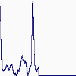
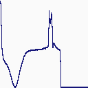

# CardioIA — Ir Além 2: diagnóstico visual de ECG com rede neural MLP

Uma rede neural do tipo **MLP (Perceptron Multicamadas)**, construída em Keras,
que classifica **imagens de batimentos cardíacos** como **normal** ou
**anormal**.

## 👨‍🎓 Integrantes
- Victor Copque dos Reis — RM566821
- Victor Hugo Ferreira Rolim — RM568006

## 🎬 Vídeo de demonstração

**YouTube (não listado):** https://www.youtube.com/watch?v=0CCFFL9NPmQ

## 📌 Arquivos

| Arquivo | Conteúdo |
|---|---|
| [`ecg_mlp.ipynb`](ecg_mlp.ipynb) | Notebook completo, comentado e já executado |
| [`exemplos/`](exemplos/) | Um batimento de cada classe: imagem gerada (`_bruta`) e entrada da rede após o pré-processamento (`_preprocessada`) |

## Dados

**ECG Heartbeat Categorization Dataset** (Kaggle,
[`shayanfazeli/heartbeat`](https://www.kaggle.com/datasets/shayanfazeli/heartbeat)),
o dataset recomendado no enunciado. Ele foi derivado do **MIT-BIH Arrhythmia
Database** (PhysioNet): 48 gravações de 47 pacientes, feitas entre 1975 e 1979.
Cada linha é um batimento com 187 amostras de sinal e uma classe:

| Classe | Tipo | Treino | Teste |
|---|---|---|---|
| 0 | **N** — normal | 72.471 | 18.118 |
| 1 | **S** — ectópico supraventricular | 2.223 | 556 |
| 2 | **V** — ectópico ventricular | 5.788 | 1.448 |
| 3 | **F** — fusão | 641 | 162 |
| 4 | **Q** — não classificável / marcapasso | 6.431 | 1.608 |

Para a tarefa binária, a classe 0 é **normal** e as classes 1 a 4 são
**anormal**. O notebook baixa os dados com `kagglehub`, sem precisar de conta
no Kaggle. Os CSVs (~580 MB) **não** ficam no repositório.

## Pipeline

```
sinal (187 números)
  → imagem do traçado, 128×128 RGB          (renderização)
  → tons de cinza                           ┐
  → redimensionada para 32×32               │ pré-processamento
  → invertida e normalizada para [0, 1]     │
  → achatada em vetor de 1.024              ┘
  → MLP: Dense 256 → Dropout → Dense 128 → Dropout → Dense 1 (sigmoide)
  → P(anormal)
```






**Por que gerar imagens:** o dataset recomendado traz o **sinal** numérico, não
imagens. Para seguir a proposta de diagnóstico **visual**, cada batimento é
desenhado como o traçado apareceria num monitor, e a rede aprende a partir
dessa imagem.

**Desbalanceio:** 83% dos batimentos são normais. O **treino** usa todos os
15.083 anormais e o mesmo número de normais sorteados, para a rede não aprender
a "chutar normal". O **teste** mantém a proporção real, para a avaliação
refletir o uso real.

## Resultados (teste, 21.892 batimentos)

| | Sempre "normal" (linha de base) | **MLP** |
|---|---|---|
| Acurácia | 82,8% | **95,9%** |
| Recall de anormal | 0% | **94,9%** |
| Precisão de anormal | — | 83,4% |
| Anomalias perdidas (de 3.774) | 3.774 | **191** |
| Alarmes falsos | 0 | 713 |

- **A linha de base importa:** 82,8% de acurácia vinham de graça, só por causa
  do desbalanceio. O ganho real está no recall, que vai de 0% para 94,9%.
- **Ponto fraco: batimentos supraventriculares (S), com recall de 79%.** Esse
  batimento tem formato parecido com o normal. O que o denuncia é o
  **momento** em que ocorre, e uma imagem de um batimento isolado não carrega
  esse contexto de ritmo.
- **Os alarmes falsos vêm do treino balanceado:** a rede viu 50% de anormais
  no treino, mas eles são só 17% no teste. A tabela de limiares do notebook
  mostra a troca entre anomalias perdidas e alarmes falsos.
- **32×32 é suficiente:** com 64×64 o resultado é equivalente (recall 95,6%,
  precisão 79,5%), com 3,7 vezes mais parâmetros.

Limitações e vieses estão na seção 8 do notebook: a MLP ignora a vizinhança
dos pixels (uma CNN seria o próximo passo), não há garantia de pacientes
diferentes entre treino e teste, e a população vem de um único hospital nos
anos 1970.

## ⚙️ Como executar

```bash
pip install -r requirements.txt   # na raiz do repositório
```

Abra `ecg_mlp.ipynb` no VS Code ou no Jupyter e execute todas as células. Na
primeira execução o dataset (~100 MB compactado) é baixado. O notebook
inteiro roda em CPU em poucos minutos. A semente fixa (`SEED = 42`) e o determinismo do
TensorFlow fazem os resultados saírem idênticos a cada execução.

## Referências

- Kachuee, M.; Fazeli, S.; Sarrafzadeh, M. *ECG Heartbeat Classification: A
  Deep Transferable Representation*. IEEE ICHI, 2018.
- Moody, G.B.; Mark, R.G. *The impact of the MIT-BIH Arrhythmia Database*.
  IEEE Engineering in Medicine and Biology, 20(3):45-50, 2001.
